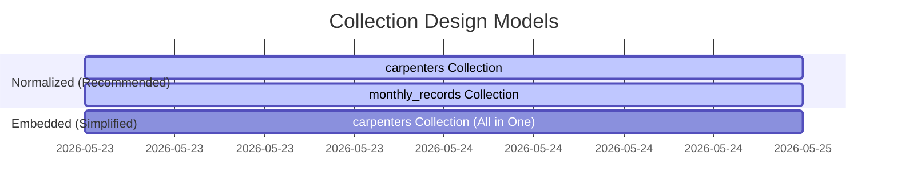

# MongoDB Schema Design — Carpenter Bonus Tracker (SVP)

This document provides a production-grade MongoDB schema design tailored for use with **MongoDB Compass**. It includes two design approaches (Embedded vs. Normalized), indexes for performance optimization, sample records, and copy-pasteable **JSON Schema Validation** rules for MongoDB Compass to enforce data integrity.

---

## 🏛️ Schema Architecture Options

In MongoDB, we can structure the data in two primary ways. For the **Carpenter Bonus Tracker (SVP)**, both models are viable, but they suit different operational requirements.



### Option A: Normalized Model (Recommended)
This model maps closely to our client-side storage architecture. It splits data into two collections: `carpenters` (metadata) and `monthly_records` (ledger partitioned by month).
* **Pros**: High query efficiency when scanning records for a specific month (e.g. generating the monthly report tab); prevents documents from growing infinitely over the years.
* **Cons**: Requires a lookup operation (`$lookup` join) if you need carpenter metadata and details in a single query.

### Option B: Embedded Model (Self-Contained)
This model embeds a carpenter's entire historical visit ledger directly inside a single carpenter document as a nested array of months.
* **Pros**: Simple queries; a single read fetches the entire profile and all history.
* **Cons**: The document grows larger every month; more complex queries are needed to filter out a single month's statistics for shop metrics.

---

## 📂 Option A: Normalized Schema Specification (Recommended)

### 1. `carpenters` Collection
Stores carpenter metadata profiles.

#### Sample Document
```json
{
  "_id": {"$oid": "664ea010f3c5b8a07c11f0ea"},
  "name": "Ca Palani Srinivasapuram",
  "phone": "+917305757038",
  "createdAt": {"$date": "2026-05-23T00:16:21.000Z"}
}
```

#### MongoDB Compass JSON Schema Validation
Copy-paste this rule into the **Validation** tab in MongoDB Compass under `Create Collection` or `Collection Rules` to enforce database integrity:
```json
{
  "$jsonSchema": {
    "bsonType": "object",
    "required": ["name", "phone", "createdAt"],
    "properties": {
      "name": {
        "bsonType": "string",
        "minLength": 1,
        "description": "Must be a non-empty string indicating the carpenter's name"
      },
      "phone": {
        "bsonType": "string",
        "pattern": "^(\\+91)?[6-9]\\d{9}$",
        "description": "Must be a valid Indian phone number starting with +91 or a 10-digit number"
      },
      "createdAt": {
        "bsonType": "date",
        "description": "Creation date timestamp"
      }
    }
  }
}
```

---

### 2. `monthly_records` Collection
Partitioned ledger storing visit states, purchases, and bonus status.

#### Sample Document
```json
{
  "_id": {"$oid": "664ea025f3c5b8a07c11f0eb"},
  "carpenterId": {"$oid": "664ea010f3c5b8a07c11f0ea"},
  "month": "2026-05",
  "visits": [
    { "visitNumber": 1, "completed": true, "date": "22 May", "purchase": 1500 },
    { "visitNumber": 2, "completed": true, "date": "23 May", "purchase": 3500 },
    { "visitNumber": 3, "completed": false, "date": null, "purchase": 0 },
    { "visitNumber": 4, "completed": false, "date": null, "purchase": 0 },
    { "visitNumber": 5, "completed": false, "date": null, "purchase": 0 }
  ],
  "totalPurchase": 5000,
  "bonusEligible": false
}
```

#### MongoDB Compass JSON Schema Validation
Paste this rule into MongoDB Compass when setting up the `monthly_records` collection to enforce exact arrays, bounds, and structures:
```json
{
  "$jsonSchema": {
    "bsonType": "object",
    "required": ["carpenterId", "month", "visits", "totalPurchase", "bonusEligible"],
    "properties": {
      "carpenterId": {
        "bsonType": "objectId",
        "description": "Foreign reference linking to carpenters._id"
      },
      "month": {
        "bsonType": "string",
        "pattern": "^\\d{4}-\\d{2}$",
        "description": "Target year-month identifier formatted as YYYY-MM"
      },
      "visits": {
        "bsonType": "array",
        "minItems": 5,
        "maxItems": 5,
        "items": {
          "bsonType": "object",
          "required": ["visitNumber", "completed", "date", "purchase"],
          "properties": {
            "visitNumber": {
              "bsonType": "int",
              "minimum": 1,
              "maximum": 5
            },
            "completed": {
              "bsonType": "bool"
            },
            "date": {
              "bsonType": ["string", "null"]
            },
            "purchase": {
              "bsonType": ["double", "int", "long"],
              "minimum": 0
            }
          }
        },
        "description": "Array containing exactly 5 sequential visits"
      },
      "totalPurchase": {
        "bsonType": ["double", "int", "long"],
        "minimum": 0,
        "description": "Computed aggregate sum of all purchases in the visits array"
      },
      "bonusEligible": {
        "bsonType": "bool",
        "description": "Computed flag: true only if 5 visits are completed and totalPurchase >= 5000"
      }
    }
  }
}
```

---

## ⚡ Indexing Strategies for MongoDB Compass

To maintain sub-millisecond query performance as the database scales, build these indexes in the **Indexes** tab of MongoDB Compass:

### 1. Unique Phone Constraints on `carpenters`
Prevents duplicate profile creations.
* **Fields**: `{ phone: 1 }`
* **Options**: `Unique = true`

### 2. Compound Partition Index on `monthly_records`
Accelerates data retrieval for month transitions and specific searches.
* **Fields**: `{ carpenterId: 1, month: 1 }`
* **Options**: `Unique = true` (Ensures a carpenter can have *only one* ledger document per month)

### 3. Report Filter Query Index
Optimizes dashboard analytics and monthly downloads.
* **Fields**: `{ month: 1, bonusEligible: 1, totalPurchase: -1 }`
* **Options**: Standard index.

---

## 🔮 Compass Query & Aggregation Pipeline Example

To fetch a complete report dashboard showing names, phones, total purchases, and eligibility for a target month (e.g. `2026-05`), run this **Aggregation Pipeline** inside MongoDB Compass:

```json
[
  {
    "$match": {
      "month": "2026-05"
    }
  },
  {
    "$lookup": {
      "from": "carpenters",
      "localField": "carpenterId",
      "foreignField": "_id",
      "as": "carpenter"
    }
  },
  {
    "$unwind": "$carpenter"
  },
  {
    "$project": {
      "_id": 0,
      "name": "$carpenter.name",
      "phone": "$carpenter.phone",
      "month": 1,
      "totalPurchase": 1,
      "bonusEligible": 1,
      "completedVisits": {
        "$size": {
          "$filter": {
            "input": "$visits",
            "as": "visit",
            "cond": { "$eq": ["$$visit.completed", true] }
          }
        }
      }
    }
  },
  {
    "$sort": {
      "bonusEligible": -1,
      "totalPurchase": -1
    }
  }
]
```
